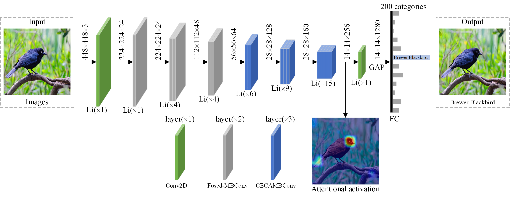

# CMSEA (PyTorch)

CMSEA: Compound Model Scaling with Efficient Attention for Fine-grained Image Classification

## CMSEA Architecture



## Requirements

```bash
pip install torch>=1.4.0

pip install torchvision>=0.5.0

pip install pyyaml
```
## Start Up
You can run the train.py to train or evaluate as follow:
``` python
python train.py /CaltechBirds-200/ --num-classes 200 --lr 3e-4 --epochs 200 --model tf_efficientnetv2_s
```

## Contact Information
If you have any suggestion or question, you can leave a message here or contact us directly: guangjinzheng@qq.com. Thanks for your attention!

## Acknowledgment
Thanks to [pytorch-image-models](https://github.com/rwightman/pytorch-image-models) and [EfficientNet](https://github.com/google/automl/tree/master/efficientnetv2).
